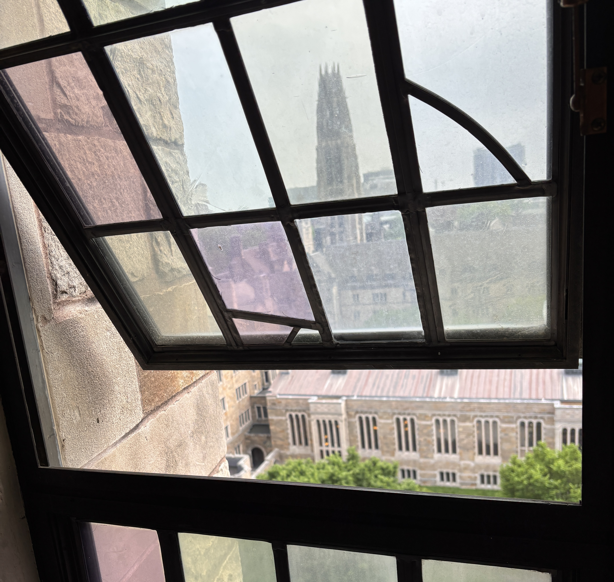

The day after my last (probably) ever university lecture, I was hit by the weight of the immense, shattering reality that my academic career (for the foreseeable future) was almost over. Propelled partly by this devastating realisation and partly by the blinding stress of having a paper exam for the first time in two years, I decided to be as student as I possibly could for the week before my exam. I would be the studentest student that has ever studented. Libraries would shake in their boots, cafes would hate to see me coming.

I formulated a multi-pronged strategy for my final poster. It involved extensive meal-prep, looking and feeling my best as much as possible, and working out in my study breaks. Most relevant to this piece, however, I pledged to try two different study spots everyday for six days. One of my favourite things about New Haven is how easy it is to just exist here, to be part of a general population of young people going about having their days - writing, reading, engaging in discourse, doing whatever it is young people do - and I wanted to envelope myself in that energy. On the agenda was an entire semester’s worth of material. A comprehensive, biologically motivated overview of Advanced Computer Vision - heavy on the vision, and more math than computer - and I was hoping to add as many new neural pathways as I could with the changing locations. 

## Day One

Starting out on a Sunday morning, bright and hopeful, I set my sights on Fepo Cafe. Reliable internet, plenty of tables, and soft nondescript pop covers playing through the speakers were among its merits. I was not the first to have this idea, however, as the place turned out to be overrun by exam season victims, and I faced my first failure. 

### Spot One

Still bright but marginally less hopeful, I turned to my first backup - Book Trader Cafe. Used bookstore-cum-cafe, Book Trader was a well-loved New Haven staple for me, both for intense work and chill days off. For once aligning my choices with fate’s plans, I zeroed in on the only empty table in the place. Sandwiched between my lady crush on one side and a riveting yap session on the other, I managed to have a fairly productive morning, making the first dent in the mountain that was my computer vision syllabus. 

  

### Spot Two

Determined not to plateau at this moderate success, I decided a library would be the optimal next move. I picked the Gilmore Music Library because while it was a Big Scary Quiet library, it had plenty of nooks and crannies that tempered the scariness enough to motivate focus without inciting anxiety. I found my goldilocks spot at the very edge of the universe (library), on the one single inhabitable planet (empty study nook).

Surrounded by the most beautiful books, most older than me, I realised these colours - warm, light oak furniture, the greens and reds of hand-bound academic volumes - form the visual landscape of a “library” for me, a place where I really do feel at home. I had the most incredible lock-in here, reaching my goal for day one of my immersive reading week. 

  

## Day Two

Monday was beautiful and warm, and I knew from the start that yesterday’s streak of success would come to a crashing halt today. As always wise to the ways of the simulation, I ran out of toilet paper. 

### Spot Three

To make up for the odds stacked against me, I picked a historically reliable candidate - the graduate study room at the Sterling Memorial Library. Always flooded with natural light, quiet, with large desks and a vibe that is begging you to just get things done. After wrestling with my study material for all of fifteen minutes, however, I gave in to the devil on my shoulder and took a gorgeous nap in this Mecca of academia.

  

### Spot Four

In a desperate attempt to save this disgrace of a day (and render some sort of punishment), I went to the most painful, depressing, purgatory-like study space I could still maybe stomach (the stacks would fail the last requirement) - the Bass Library. In the basement of Sterling, with giant fluorescent overhead lights and soulless grey carpeting, Bass exudes an academic bleakness often associated with computer science classrooms. It has a get-things-done energy similar to the graduate study room, but this time cold and menacing. Despite controlling every other variable, however, I was unable to get a handle on my own disposition. Overstimulated by the lights, still groggy from my untimely nap, hungry and stressed, I stared at the words on my monitor till I saw spots in my vision. Utterly defeated, I called it a day. Maybe tomorrow would be better.

  

## Day Three

I woke up on Tuesday grateful for the warmth and determined to be productive, but the lightness and enthusiasm of day one was gone. It was replaced by an urgency, and the singular goal of decorating the bare walls of my brain with intricate biological diagrams of itself (self-portraits, if you will). 

### Spot Five

Stop number one was Steep Cafe at Klein Tower. Situated on top of a hill, with a glorious view of the rolling greens outside, Steep has all the beauty and light of the outside with all the facilities of the inside. With quiet determination and powered by my cappuccino, I chipped away at a fair bit of material over the course of the morning. Only once hunger threatened to take over did I decide to make the trek over to my next spot.

  

### Spot Six

The only thing that makes Fussy Coffee a seldom-visited spot for me is the twenty-five minute walk from my apartment. One of the only cafes in New Haven that has a full kitchen, Fussy happens to tick every other box for a good cafe. As a study space, however, it lacks good seating (only a few proper tables, impossible to snag one right away) and a quiet enough environment (rock music blaring on the speakers most days). On a day as beautiful as this one, however, and with my stomach as empty as it was, Fussy was a godsend for me. A hearty breakfast burrito later, nursing a glass of thai iced tea, Sisyphus got back to his boulder. 

## Day Four

Day Four of my Week of Study was like day four of the Hunger Games, in that the drudgery was quickly setting in. The adrenaline-fuelled resolve of the earlier days was gone, the easy tributes (chapters) had been picked off, and the stronger tributes (hard chapters) were not to be engaged with. Resources were running low, and the end felt so far away. The only way out is through.

### Spot Seven

Starting strong (after spending fifteen minutes trying to find the damn entrance to the damn library), I nestled in a secluded corner overlooking the courtyard outside Marx Library. The library itself is not particularly noteworthy to me - its location behind Kleine Tower is slightly inconvenient, and its famed easily accessible monitors are not very relevant to me. However, this specific spot proved plenty productive – maybe because I was perceptibly surrounded by people but without having anyone in my eyeline. Here, I gently coaxed information into my brain the way you feed a fussy baby.

  

### Spot Eight

The only spot in this week that I did not voluntarily pick was this one - my office in Dunham Laboratory. Forced by the office hours slotted in my schedule, I spent the remainder of the day in my clinical, grey, windowless, soul-sucking cubicle. Having the place to myself, however, was some consolation, and with sufficient self-disciplining (and a carefully curated playlist of classical music that was ubiquitous over the week) I was able to make a generally hyper-unproductive space work for me. 

## Day Five

Scheduled to be the heaviest study day in my plan, Thursday proved to be quite a challenge. Already tired of the material and a little burnt out, now I was also overwhelmed by the amount left to study. The “this will never be on the exam”s were coming fast and loose, and I was skipping slides left and right.

### Spot Nine

The Elm in the underground of the Schwarzman Centre is a frequent haunt for undergraduate students. Hoping to be inspired by their spirit, I took my tired butt over and found myself a table. Quickly, the usual problems with the place began to plague me. The god-awful wifi, the terrible din of kids who have never been asked to shut up, and the AC that is always too cold together caused a discomfort that was almost impressive. I have had my good times at the Elm - bad coffee and shoes on the couch are sometimes the vibe - but this was not one of them. Once I had spent enough time staring at my screen to consider this a “study session”, I called in backup. 

### Spot Ten

As a Hail Mary, I initiated a group study session with a friend. We met in the hallowed halls of the Pierson College Common Room (floor-to-ceiling windows overlooking the lush courtyard, cozy fifty year old sofas, giant mahogany desks) to convince each other that we were both the same degree of clueless. It turned out, however, that he needed a fair number of things explained to him, and this proved quite beneficial as a review session for me. The place was peppered with a few undergrads writing final papers, and the general mood of the room was light and hopeful, and I left feeling a great deal more confident than when I walked in. 

## Day Six

As a general rule, if you don’t know something hugely complex by the last day before the exam, you’re just not going to know it. The final stretch is for review, rest, and in this case, basking in the last of the exam stress. 

### Spot Eleven

I saved this spot for a lighter day (and a reward for when I got enough done) - the Philosophy Reading Room at Sterling Memorial Library. This room and I go way back. It was the first room I found at the library when I started at Yale, and it has remained my favourite. Always flooded with soft sunlight filtering through the coloured panes in the windows, with armchairs so old all the leather has peeled off and you sit in the depression collectively moulded by many a Yalie butt, surrounded by thousands and thousands of years of human thought – working here is easy. It feels natural. It feels like this is what I was made to do. And so here I plowed through the last bit of new material.

  

### Spot Twelve

For my last hurrah, I picked MOTW Coffee. I honestly cannot remember why - I think I was hungry? A little removed from the campus spaces but close enough to walk, MOTW features a beautiful handpainted wall mural, incredibly millennial decor, the best chai in New Haven, and delicious - if slightly overpriced - bites. Here, surrounded by plastic ferns and multiple first dates, I reviewed everything I had learnt in the last week. 

My professor once said, “all I can say is I really hope you realise what this class is, because I would have given anything to have a class like this when I was in university”, and I was really starting to see what he meant. Vision is one of the most complex and baffling processes in biology, and to understand how the lowest level on/off light signals are aggregated over and over again, through layers and layers of abstraction to create lines and contours and objects and recognition is magical. To then use this information to mathematically model neural networks inspired by vision systems in the brain is otherworldly. 

When I finally walked into that exam, I cannot say I wasn’t scared of the outcome, but this fear was greatly overpowered by gratitude. Gratitude for the process – of learning, of doing university, of interacting with incredible minds, of existing in an environment that is entirely composed of growth. It really is about the friends we make along the way - whether those friends are people, books, libraries, cafes, or concepts.
